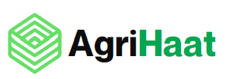

# AgriHaat

### Overview

Indian farmers face numerous challenges, including limited market access, price manipulation by middlemen, inefficient resource allocation, and volatile income due to fluctuating crop prices. This project seeks to address these problems by providing an AI-driven platform that leverages machine learning and data-driven insights to optimize the farming process end-to-end.

At its core, the platform aims to empower farmers by eliminating middlemen, ensuring a fair price for their produce, and improving access to critical resources like tractors and fertilizers. By analyzing a farmer's historical crop quality, land availability, and geographical proximity to similar farmlands, the platform allocates crops to each farmer in a way that maximizes both productivity and profitability. This data-driven approach ensures that every farmer grows crops best suited to their conditions while meeting market demands.

Moreover, a **Fair Farm Price (FFP)** model guarantees farmers a price higher than the Minimum Support Price (MSP) by factoring in inflation and global exchange rates, using an advanced machine learning algorithm. This system protects farmers from the traditional risks of price volatility and market exploitation, ensuring a sustainable income stream.

The platform also features an **Optimized Resource Allocation System**, which uses buyer advances (10% of the total contract value) to allocate critical farming tools and resources efficiently. This ensures that farmers have access to shared resources like tractors, fertilizers, and other essential equipment, boosting their operational efficiency without the need for individual ownership or high upfront costs.

Additionally, the platform incorporates a **Direct Market Access** system, which removes middlemen by directly connecting farmers with buyers. Buyers can place orders that match their needs based on crop quality, quantity, variety, and farm-to-buyer proximity, thus improving market transparency and securing better contracts for farmers.

Finally, the platform includes an **Interactive Farmer Awareness Portal** that provides real-time insights into market trends, weather forecasts, crop recommendations, and best farming practices. This knowledge hub empowers farmers with the information they need to make informed decisions, ultimately improving their yields and profitability.

---

### Features

- **Optimized Crop Allocation**: The platform assigns crops to farmers based on historical crop quality, land availability, and proximity to similar types of land, ensuring optimized crop production.
- **Fair Farm Price (FFP)**: An ML-based dynamic pricing model guarantees prices above the MSP, factoring in inflation and global exchange rates, securing a profitable margin for farmers.
- **Direct Market Access**: By removing middlemen, the platform allows farmers to directly connect with buyers, ensuring they receive a fairer share of revenue.
- **Optimized Resource Allocation**: A system funded through a 10% buyer advance optimizes the distribution of essential farming resources like government-owned tractors and fertilizers to enhance operational efficiency.
- **Interactive Farmer Awareness Portal**: Provides real-time market insights, farming best practices, and personalized recommendations to empower farmers to make better decisions.
- **Assured Market Access**: Through contract farming agreements, farmers are assured of stable buyers and timely payments, reducing income fluctuations.
